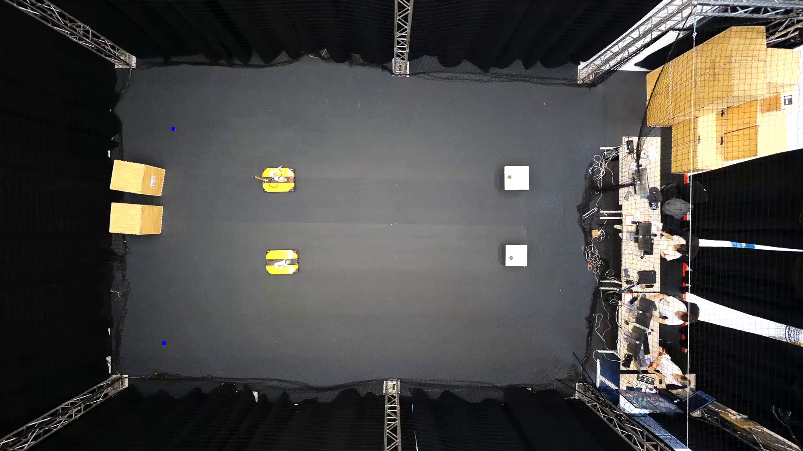

# video_trajectory_rendering

## Camera calibration
1. Change path to the input video in `camera_matrix_calibration.py`
2. Set 4 world cordinates for the reference points in `camera_matrix_calibration.py`
3. Run script: 
```bash
python3 camera_matrix_calibration.py
```
4. Select 4 reference points in the rendered figure. The selected points are rendered as the blue dots.



5. The calibration matrix is automatically computed and saved as `camera_calibration_matrix.csv`. The provided reference world coordinates
are tested with the new calibration matrix and rendered as the red dots.


## Trajectory rendering
1. Change path to the input video in `render_data_video.py`
2. Change path to the recorded data in `render_data_video.py`
3. Run script: 
```bash
python3 render_data_video.py
```
